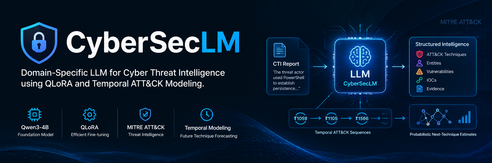
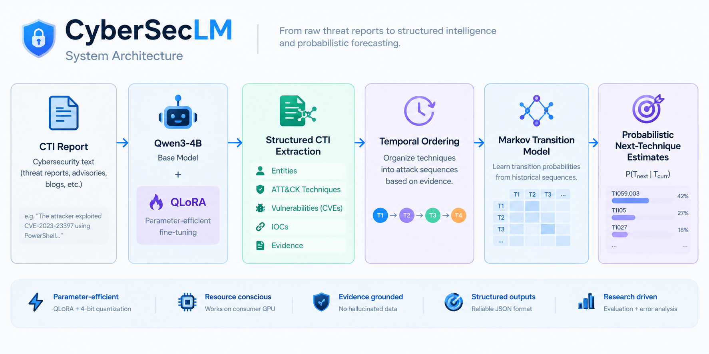

<div align="center">

  

  <br>

  <p>
    <strong>CyberSecLM</strong> is a domain-specific language model for extracting
    structured, evidence-grounded intelligence from Cyber Threat Intelligence reports.
  </p>

  <p>
    Built with <strong>Qwen3-4B</strong> and <strong>QLoRA</strong>, it identifies
    MITRE ATT&CK techniques and prepares temporally ordered attack sequences for
    probabilistic transition analysis.
  </p>

  <p>
    
  </p>

</div>

> **Research objective:** Measure whether resource-efficient domain adaptation
> improves ATT&CK technique extraction, then use observed technique sequences for
> probabilistic transition analysis.

> ⚠️ **Project scope:** CyberSecLM is a focused research prototype, not a
> full-fledged general-purpose cybersecurity LLM. It extracts structured MITRE
> ATT&CK techniques and uses historical technique transitions to estimate probable
> subsequent techniques. These estimates describe statistical patterns and do
> **not** deterministically predict an attacker's exact next action.

---

## 🔬 Research Question

> **Can a resource-efficient, domain-adapted LLM reliably extract structured and temporally ordered cyber-threat intelligence, and can those extracted ATT&CK sequences support lightweight probabilistic forecasting of subsequent techniques?**

The project is designed around a consumer GPU and therefore emphasizes:

* ⚡ Parameter-efficient fine-tuning
* 🧠 Small open-source language models
* 💾 4-bit quantization
* 📋 Structured outputs
* 🔎 Evidence-grounded extraction
* 📊 Reproducible evaluation
* 📈 Lightweight temporal modeling

---

## 🧠 Architecture



CyberSecLM follows a resource-efficient pipeline for transforming unstructured
Cyber Threat Intelligence (CTI) reports into structured and temporally ordered
attack intelligence.

### Pipeline

**1. CTI Report**  
Raw cybersecurity reports containing information about threat actors, malware,
vulnerabilities, indicators of compromise (IOCs), and attack techniques.

**2. Qwen3-4B + QLoRA**  
A small open-source language model adapted to the cybersecurity domain using
parameter-efficient QLoRA fine-tuning.

**3. Structured CTI Extraction**  
The model extracts structured information such as entities, MITRE ATT&CK
techniques, vulnerabilities, IOCs, and supporting evidence.

**4. Temporal Ordering**  
Extracted ATT&CK techniques are organized according to their reported temporal
order to form attack sequences.

**5. Markov Transition Model**  
Observed ATT&CK sequences are used to construct a lightweight probabilistic
transition model between techniques.

**6. Probabilistic Next-Technique Estimates**  
The transition model estimates probable subsequent techniques based on previously
observed technique sequences. These estimates represent probabilistic patterns,
not deterministic predictions of an attacker's next action.

---

# 🤖 Current Model

**Base Model:** `Qwen/Qwen3-4B-Instruct-2507`

The model is adapted using:

* 4-bit NF4 quantization
* bfloat16 computation
* Double quantization
* LoRA adapters
* PEFT
* TRL / `SFTTrainer`

### QLoRA Configuration

| Parameter             | Value              |
| --------------------- | ------------------ |
| LoRA rank             | `16`               |
| LoRA alpha            | `32`               |
| LoRA dropout          | `0.05`             |
| Quantization          | 4-bit NF4          |
| Compute dtype         | bfloat16           |
| Double quantization   | Enabled            |
| Optimizer             | `paged_adamw_8bit` |
| Batch size            | `1`                |
| Gradient accumulation | `4`                |
| Learning rate         | `2e-4`             |
| Epochs                | `3`                |

Only approximately **0.29% of the model parameters** are trainable through LoRA adapters.

---

# 🎯 Project Scope

The original project considered several CTI extraction tasks.

The current experimental focus has been narrowed to:

> **MITRE ATT&CK technique extraction from cybersecurity text.**

This provides a clearly measurable first research problem before adding the temporal modeling component.

The broader structured CTI schema remains part of the long-term architecture.

---

# 📋 Structured CTI Schema

The broader CyberSecLM extraction schema is designed around:

```json
{
  "entities": [
    {
      "type": "threat_actor | malware | campaign | product",
      "name": "..."
    }
  ],
  "techniques": [
    {
      "id": "...",
      "name": "...",
      "evidence": "..."
    }
  ],
  "vulnerabilities": [
    {
      "cve_id": "...",
      "product": "...",
      "version": "...",
      "type": "...",
      "evidence": "..."
    }
  ],
  "iocs": [
    {
      "type": "ip | domain | hash | url",
      "value": "..."
    }
  ],
  "evidence": [
    {
      "claim": "...",
      "text": "..."
    }
  ]
}
```

The extraction system follows an important constraint:

> **Only information explicitly supported by the source text should be extracted.**

The model should not invent ATT&CK techniques, entities, vulnerabilities, IOCs, or other information that cannot be supported by the input.

In particular, ATT&CK IDs should **not** be forced onto text when the mapping is ambiguous or unsupported.

---

# 🧪 Initial Baseline Experiments

Before fine-tuning, the base Qwen model was evaluated in two stages.

## 1. Generic Cybersecurity QA

A small manually constructed set of cybersecurity questions was used to determine whether the base model already possessed general cybersecurity knowledge.

The model generally handled topics such as:

* CVEs
* CVSS
* Vulnerabilities
* Exploits
* Affected software versions
* Basic cybersecurity terminology

This established that the project was not primarily trying to teach the model basic cybersecurity vocabulary from scratch.

The more interesting problem was **structured extraction and ATT&CK mapping**.

---

## 2. Initial CTI Extraction Smoke Test

A five-example manually constructed CTI dataset was created covering:

1. CVE-2021-44228 / Apache Log4j exploitation
2. PowerShell / Cobalt Strike
3. CVE-2023-23397 / Microsoft Outlook
4. RDP-based lateral movement
5. Spearphishing / Microsoft Word / PowerShell

The initial baseline showed that the base model could extract some cybersecurity information, particularly:

* CVE identifiers
* IOCs
* Some entities

However, ATT&CK technique extraction was inconsistent.

Observed issues included:

* Missing techniques
* Incomplete extraction
* Incorrect categorization
* Inconsistent structured output
* Missing evidence
* Occasional generation truncation

This smoke test motivated the move to a larger formally evaluated dataset.

---

# 📚 TRAM Dataset

The project uses the **TRAM (Threat Report ATT&CK Mapper)** dataset for the current ATT&CK extraction experiment.

The original TRAM `multi_label.json` contains:

| Property                 |  Count |
| ------------------------ | -----: |
| Total records            | 19,178 |
| Labeled records          |  4,070 |
| Unlabeled records        | 15,108 |
| Unique ATT&CK techniques |     50 |
| Unique documents         |    151 |

The dataset has a highly imbalanced label distribution.

### Label Distribution

```text
1 technique      3,239 examples
2 techniques      669 examples
3 techniques      124 examples
4 techniques       19 examples
5 techniques        9 examples
6 techniques        7 examples
8 techniques        2 examples
15 techniques       1 example
```

This long-tail distribution became an important part of the later error analysis.

---

# 🔀 Dataset Preparation

The raw TRAM data contains many examples with empty labels.

These examples were **not automatically treated as negative examples**.

An empty label may represent an unannotated example rather than a verified `"no technique present"` example.

Therefore, the supervised training pipeline uses only examples with explicit technique annotations.

The unlabeled examples remain preserved in the raw dataset.

---

# 🔒 Document-Level Data Split

To reduce document leakage, the dataset was split at the **document level**, rather than randomly splitting individual sentences.

Using a fixed seed of `42`:

| Split      | Documents |
| ---------- | --------: |
| Training   |       105 |
| Validation |        22 |
| Test       |        24 |
| **Total**  |   **151** |

### Raw Split Sizes

| Split      | Examples |
| ---------- | -------: |
| Training   |   13,189 |
| Validation |    3,149 |
| Test       |    2,840 |

### Labeled Examples Used

| Split      | Labeled Examples |
| ---------- | ---------------: |
| Training   |        **2,866** |
| Validation |          **653** |
| Test       |          **551** |

Technique coverage was also checked:

```text
Training techniques:       50
Validation techniques:     48
Test techniques:           47
```

There were no techniques present in validation or test that were completely unseen during training.

This avoids an obvious label-space mismatch between training and evaluation, although it does not eliminate broader generalization concerns.

---

# 🧾 Training Dataset Format

The prepared dataset uses a three-message instruction format:

```text
system
user
assistant
```

The system instruction asks the model to identify ATT&CK techniques explicitly supported by the text and return only valid JSON.

Example:

```json
{
  "techniques": [
    "T1059.001",
    "T1566.001"
  ]
}
```

The dataset validator checks:

* Message structure
* Message roles
* Non-empty content
* Valid JSON
* Presence of the `techniques` field
* List format
* Valid ATT&CK ID structure

All prepared datasets passed validation.

---

# ⚙️ QLoRA Training

The model was fine-tuned on the prepared TRAM training set.

| Training Detail      |  Value |
| -------------------- | -----: |
| Training examples    |  2,866 |
| Validation examples  |    653 |
| Epochs               |      3 |
| Optimizer steps      | ~2,151 |
| Trainable parameters | ~0.29% |

The resulting adapter was saved to:

```text
experiments/cyberseclm-tram-qlora/
```

An earlier three-example training run was performed as a pipeline smoke test. That artifact is kept separate from the actual TRAM experiment and is **not used as the research result**.

---

# 📊 Evaluation Method

The fine-tuned model was evaluated against the **551-example held-out TRAM test set**.

The base Qwen3-4B model was evaluated on exactly the same examples.

This provides a direct comparison:

```text
Base Qwen3-4B
      vs
CyberSecLM QLoRA
```

For each example:

```text
TP = predicted ∩ ground truth

FP = predicted - ground truth

FN = ground truth - predicted
```

The evaluation reports:

* Precision
* Recall
* F1
* Exact Match
* JSON parse failures

Generation was deterministic using greedy decoding.

---

# 🏆 Main Evaluation Results

## Base Qwen3-4B

```text
Precision:       0.0453
Recall:          0.0246
F1:              0.0319
Exact Match:     0.0127

TP:                  18
FP:                 379
FN:                 713

JSON parse errors:   19
```

## CyberSecLM — QLoRA

```text
Precision:       0.6519
Recall:          0.6047
F1:              0.6274
Exact Match:     0.5154

TP:                 442
FP:                 236
FN:                 289

JSON parse errors:    0
```

## Side-by-Side

| Metric      | Base Qwen3-4B | CyberSecLM |
| ----------- | ------------: | ---------: |
| Precision   |        0.0453 | **0.6519** |
| Recall      |        0.0246 | **0.6047** |
| F1          |        0.0319 | **0.6274** |
| Exact Match |        0.0127 | **0.5154** |

### Improvement

```text
Precision:       +60.66 percentage points
Recall:          +58.01 percentage points
F1:              +59.55 percentage points
Exact Match:     +50.27 percentage points
```

The fine-tuned model achieved approximately:

> **19.7× the baseline F1**

Exact-match performance increased from:

> **1.27% → 51.54%**

### Per-Example Comparison

```text
CyberSecLM better:      403
Base better:              6
Same correctness:       142
```

CyberSecLM produced exact matches on:

```text
284 / 551
```

test examples, compared with:

```text
7 / 551
```

for the base model.

---

# 🔎 Result Interpretation

The held-out TRAM evaluation indicates that QLoRA fine-tuning produced a **substantial improvement in ATT&CK technique extraction** over zero-shot Qwen3-4B on this test set.

The result should specifically be interpreted as:

> **Improved performance on the held-out TRAM ATT&CK extraction benchmark.**

It should not yet be interpreted as proof of broad real-world CTI understanding or generalization to arbitrary threat reports.

The current experiment establishes the extraction component of the research pipeline.

---

# 🧠 Error Analysis

The evaluation was followed by a detailed error analysis rather than stopping at aggregate F1.

The analysis examined:

1. Per-technique performance
2. Missed techniques
3. False-positive techniques
4. Exact-match performance
5. Representative prediction errors
6. Single-label vs multi-label performance
7. Test-support frequency vs F1
8. Error-type distribution
9. Training frequency vs test performance
10. Base-model vs fine-tuned predictions

---

# 📈 Per-Technique Performance

Several techniques achieved strong performance:

| Technique | Test Support | Precision | Recall |        F1 |
| --------- | -----------: | --------: | -----: | --------: |
| T1190     |           11 |     1.000 |  1.000 | **1.000** |
| T1140     |           83 |     0.936 |  0.880 | **0.907** |
| T1053.005 |           15 |     0.867 |  0.867 | **0.867** |
| T1056.001 |           11 |     1.000 |  0.727 | **0.842** |
| T1021.001 |            6 |     0.600 |  1.000 | **0.750** |
| T1113     |            7 |     0.714 |  0.714 | **0.714** |
| T1027     |           92 |     0.649 |  0.783 | **0.709** |
| T1566.001 |           22 |     0.714 |  0.682 | **0.698** |
| T1105     |           49 |     0.717 |  0.673 | **0.695** |
| T1574.002 |           24 |     0.929 |  0.542 | **0.684** |

Several low-support techniques had zero observed F1, including:

```text
T1573.001
T1033
T1074.001
T1552.001
T1210
T1068
```

These should be interpreted cautiously because some have extremely small test support.

---

# 📉 Most Frequently Missed Techniques

| Technique | Missed |
| --------- | -----: |
| T1059.003 |     24 |
| T1027     |     20 |
| T1070.004 |     18 |
| T1105     |     16 |
| T1574.002 |     11 |
| T1112     |     11 |
| T1071.001 |     10 |
| T1140     |     10 |
| T1573.001 |     10 |
| T1041     |     10 |
| T1082     |     10 |
| T1204.002 |      9 |
| T1548.002 |      9 |
| T1106     |      7 |
| T1005     |      7 |

This indicates that **missing supported techniques** is a significant failure mode.

---

# ⚠️ Most Common False Positives

| Technique | False Positives |
| --------- | --------------: |
| T1027     |              39 |
| T1059.003 |              31 |
| T1082     |              15 |
| T1105     |              13 |
| T1071.001 |              12 |
| T1083     |              10 |
| T1078     |               9 |
| T1016     |               8 |
| T1090     |               8 |
| T1036.005 |               7 |
| T1566.001 |               6 |
| T1005     |               6 |
| T1140     |               5 |
| T1204.002 |               4 |
| T1055     |               4 |

The model therefore has recurring confusion around semantically related or commonly co-occurring techniques.

---

# 🔗 Single-Label vs Multi-Label Performance

One of the clearest findings is that **multi-label extraction is substantially harder than single-label extraction**.

### Single-label

```text
Examples:          416
Exact matches:     270
Exact match:     64.9%

Precision:       0.639
Recall:          0.712
F1:              0.673
```

### Multi-label

```text
Examples:          135
Exact matches:      14
Exact match:     10.4%

Precision:       0.679
Recall:          0.463
F1:              0.551
```

### Key Observation

```text
Single-label F1:          0.673
Multi-label F1:           0.551

Single-label EM:          64.9%
Multi-label EM:           10.4%
```

The model can often identify at least one correct technique in multi-label examples, but frequently fails to recover the **complete set**.

This makes multi-label extraction one of the primary areas for future improvement.

---

# 🧩 Error-Type Distribution

| Error Type           | Count | Percentage |
| -------------------- | ----: | ---------: |
| Exact match          |   284 |  **51.5%** |
| Mixed error          |   161 |  **29.2%** |
| Underprediction only |    77 |  **14.0%** |
| Overprediction only  |    29 |   **5.3%** |

The dominant non-exact category is **mixed error**, followed by **underprediction**.

Pure overprediction is comparatively less common.

This suggests that the primary problem is not simply hallucinating large numbers of unsupported techniques. A substantial portion of the remaining error comes from **missing techniques or confusing related techniques**.

---

# 📊 Training Frequency & Long-Tail Behavior

The TRAM dataset has a strongly imbalanced technique distribution.

Some low-frequency techniques performed poorly:

```text
T1068
Train: 3
F1: 0.000

T1552.001
Train: 16
F1: 0.000

T1033
Train: 27
F1: 0.000

T1573.001
Train: 35
F1: 0.000
```

However, training frequency does **not** completely explain performance.

Several techniques with substantially more training examples still had modest performance:

```text
T1090
Train: 120
F1: 0.444

T1071.001
Train: 107
F1: 0.476

T1082
Train: 84
F1: 0.468

T1078
Train: 121
F1: 0.571
```

At the same time, some techniques with relatively limited training support performed strongly:

```text
T1190
Train: 44
F1: 1.000

T1056.001
Train: 36
F1: 0.842

T1113
Train: 34
F1: 0.714
```

The current analysis therefore suggests two likely sources of difficulty:

1. **Long-tail / representation scarcity**
2. **Semantic ambiguity and confusion between related techniques**

The results show an association between training frequency and performance in many cases, but do **not** establish causality.

---

# 📐 Test Support vs Performance

Average F1 was grouped by the number of test examples supporting each technique:

| Test Support | Techniques | Average F1 |
| ------------ | ---------: | ---------: |
| 1–2          |          8 |      0.133 |
| 3–5          |          9 |      0.355 |
| 6–10         |         11 |      0.346 |
| 11–20        |         14 |      0.611 |
| 21–50        |          5 |      0.623 |
| 51+          |          3 |      0.752 |

The pattern suggests that techniques with very small test support are associated with unstable or poor observed F1.

However, test support is not training frequency, and low-support metrics have high variance.

These values are therefore treated as **descriptive analysis rather than evidence of causation**.

---

# 🧪 Representative Errors

Representative errors revealed several recurring patterns.

### Missing one technique

```text
Ground truth:
T1027, T1106

Prediction:
T1027
```

The model correctly identifies one technique but fails to complete the multi-label set.

### Confusing related techniques

```text
Ground truth:
T1055, T1204.002

Prediction:
T1218.011
```

The model selects an unsupported technique instead of the techniques supported by the text.

### Partial extraction

```text
Ground truth:
T1059.003, T1090, T1105

Prediction:
T1071.001, T1090
```

The model recovers one correct technique but misses other supported techniques while introducing a false positive.

These examples reinforce the broader finding that **multi-label completeness and semantic disambiguation** are key remaining challenges.

---

# 🧹 Dataset & Annotation Decisions

Several decisions were made to keep the experiment methodologically defensible.

### Do not treat unlabeled data as negative examples

Empty labels may represent missing annotation rather than confirmed absence of a technique.

Therefore, unlabeled examples are excluded from supervised training.

### Split by document

Sentences from the same document can be highly correlated.

A document-level split was therefore used to reduce information leakage.

### Do not force ATT&CK mappings

A cybersecurity action should only receive an ATT&CK technique ID when the text provides enough evidence to support the mapping.

Generic descriptions such as `"lateral movement"` should not automatically be converted into a specific ATT&CK technique when the underlying action is not sufficiently specified.

### Do not use co-occurrence as temporal order

Multiple techniques appearing in the same sentence does **not** mean that one occurred before another.

Therefore, the TRAM sentence-level multi-label data is useful for extraction training but is **not sufficient by itself to construct temporal Markov transitions**.

This distinction is critical for the next stage.

---

# ⏱️ Temporal Modeling — Next Stage

The next research stage is to construct **temporally ordered ATT&CK sequences** from CTI reports.

The intended pipeline is:

```text
CTI Report
     │
     ▼
CyberSecLM
     │
     ▼
ATT&CK Techniques + Evidence
     │
     ▼
Temporal Ordering
     │
     ▼
T1 → T2 → T3 → T4
     │
     ▼
Transition Counts
     │
     ▼
Transition Probabilities
     │
     ▼
P(T_next | T_current)
```

A lightweight Markov model will estimate:

```text
P(T_{t+1} | T_t)
```

For example, if historical sequences contain:

```text
T1059.003 → T1105
```

repeatedly, the transition probability from `T1059.003` to `T1105` will receive corresponding statistical weight.

The model will provide **probabilistic estimates**, not deterministic attacker predictions.

---

# ⚠️ Temporal Data Constraint

The current TRAM dataset is primarily sentence-level annotated data.

Although examples can contain multiple ATT&CK techniques, their co-occurrence does **not** establish temporal order.

Therefore:

> **TRAM will be used for ATT&CK extraction training/evaluation, but a separate source or methodology is required for reliable temporal sequence construction.**

This prevents the temporal component from being built on the invalid assumption that label co-occurrence represents attack progression.

---

# 💡 Research Direction

The project is not simply:

> "Fine-tune Qwen on cybersecurity data."

The intended research contribution is the combination of:

### 1. Resource-Efficient Domain Adaptation

* Qwen3-4B
* QLoRA
* 4-bit quantization
* Consumer GPU training

### 2. Evidence-Grounded Structured CTI Extraction

* ATT&CK techniques
* Entities
* Vulnerabilities
* IOCs
* Supporting evidence

### 3. Temporal ATT&CK Modeling

* Extracted techniques
* Temporally ordered sequences
* Lightweight transition modeling
* Probabilistic next-technique estimates

The novelty of the complete approach still requires comparison with existing CTI extraction, ATT&CK mapping, and temporal threat-modeling literature before making strong claims.

---

# 🔬 Current Research Findings

The completed extraction experiment currently supports the following observations:

### QLoRA substantially improves ATT&CK extraction

```text
F1
Base Qwen3-4B       0.0319
CyberSecLM          0.6274
```

### Exact structured prediction improved substantially

```text
Exact Match
Base Qwen3-4B       1.27%
CyberSecLM         51.54%
```

### Multi-label extraction remains the main weakness

```text
Single-label F1       0.673
Multi-label F1        0.551

Single-label EM       64.9%
Multi-label EM        10.4%
```

### Errors are dominated by mixed errors and underprediction

```text
Mixed errors          29.2%
Underprediction       14.0%
Overprediction         5.3%
```

### Long-tail representation matters, but is not the entire explanation

Some rare techniques perform poorly, but some frequently represented techniques also remain difficult.

This suggests both:

* Data scarcity
* Semantic confusion / ambiguity

may contribute to the remaining errors.

### Temporal modeling requires different data assumptions

Sentence-level multi-label co-occurrence cannot be directly interpreted as temporal attack progression.

A separate temporal ordering stage is therefore required.

---

# 📁 Project Structure

```text
CyberSecLM/
│
├── data/
│   ├── baseline_questions.json
│   ├── cti_baseline.json
│   └── tram/
│       └── prepared/
│           ├── train.json
│           ├── validation.json
│           └── test.json
│
├── TRAM/
│   ├── prepare_dataset.py
│   └── analyze_results.py
│
├── src/
│   ├── model.py
│   ├── inference.py
│   ├── baseline.py
│   ├── validate_dataset.py
│   ├── qlora_model.py
│   ├── qlora_test.py
│   └── train.py
│
├── experiments/
│   ├── cyberseclm-tram-qlora/
│   └── evaluation/
│       ├── base_predictions.json
│       └── finetuned_predictions.json
│
├── requirements.txt
├── README.md
└── .gitignore
```

The original TRAM repository/dataset is maintained separately from the project's processed data.

---

# 🔄 Development Workflow

The project follows an iterative research workflow:

```text
Understand
    ↓
Define
    ↓
Build Skeleton
    ↓
Implement
    ↓
Run
    ↓
Debug
    ↓
Verify
    ↓
Evaluate
    ↓
Analyze
    ↓
Commit
    ↓
Repeat
```

The emphasis is on running small experiments, inspecting failures, and using the results to determine the next experiment rather than repeatedly changing training configurations without a defined research question.

---

# ✅ Completed

* [x] Python environment setup
* [x] CUDA/GPU setup
* [x] Qwen3-4B model loading
* [x] Chat-template based inference
* [x] Generic cybersecurity baseline
* [x] Initial CTI extraction smoke test
* [x] CTI extraction schema design
* [x] TRAM dataset investigation
* [x] Label distribution analysis
* [x] Document-level train/validation/test split
* [x] Dataset validation
* [x] QLoRA configuration
* [x] QLoRA training
* [x] Held-out base-model evaluation
* [x] Held-out fine-tuned-model evaluation
* [x] Precision / recall / F1 evaluation
* [x] Exact-match evaluation
* [x] JSON validity analysis
* [x] Per-technique error analysis
* [x] Missed-technique analysis
* [x] False-positive analysis
* [x] Single-label vs multi-label analysis
* [x] Error-type analysis
* [x] Training-frequency vs performance analysis
* [x] Test-support vs performance analysis
* [x] Representative error analysis

---

# 📍 Current Status

### Extraction Stage — **Complete**

The first complete CyberSecLM extraction experiment has been trained, evaluated, and analyzed.

Current QLoRA checkpoint:

```text
experiments/cyberseclm-tram-qlora/
```

The current experiment is being treated as a **frozen research milestone** rather than immediately retraining the model.

The analysis indicates that the next useful research step is the temporal modeling component.

---

# 🚀 Next Steps

### 1. Temporal CTI Dataset

Identify or construct CTI data where ATT&CK techniques can be placed in a defensible temporal order.

### 2. Temporal Sequence Extraction

Convert reports into sequences such as:

```text
T1566.001
    ↓
T1204.002
    ↓
T1059.001
    ↓
T1105
```

with evidence supporting each transition where possible.

### 3. Transition Matrix

Construct a transition matrix:

```text
                Next Technique
             T1      T2      T3
Current T1   ...     ...     ...
Current T2   ...     ...     ...
Current T3   ...     ...     ...
```

and normalize transition counts into probabilities.

### 4. Probabilistic Evaluation

Evaluate whether historical transition probabilities provide useful estimates of subsequent techniques.

Potential evaluation measures include:

* Top-1 accuracy
* Top-k accuracy
* Mean Reciprocal Rank
* Mean Average Precision
* Calibration / probability quality

### 5. Error-Aware Extraction Improvements

After the temporal baseline is established, revisit extraction weaknesses such as:

* Multi-label recall
* Rare techniques
* Confusion between semantically related techniques
* Underprediction
* Evidence grounding

This keeps the project experimental rather than repeatedly retraining without a clearly defined research question.

---

# 🛠️ Technologies

* Python
* PyTorch
* Hugging Face Transformers
* Hugging Face Datasets
* Hugging Face Accelerate
* Hugging Face TRL
* PEFT
* LoRA
* QLoRA
* bitsandbytes
* Qwen
* MITRE ATT&CK
* Cyber Threat Intelligence

---

# 💻 Hardware

Development and training are performed on a consumer gaming laptop equipped with:

```text
GPU:       NVIDIA GeForce RTX 5070 Ti Laptop GPU
VRAM:      12 GB
RAM:       32 GB
CPU:       AMD Ryzen 9 8940HX
```

The project intentionally uses QLoRA and 4-bit quantization to make experimentation practical within this hardware constraint.

---

# ⚠️ Limitations

The current experiment has several important limitations.

### Dataset Size

Only 4,070 of the 19,178 TRAM records contain explicit labels, and only 2,866 labeled examples are used for training after document-level splitting.

### Label Imbalance

ATT&CK techniques follow a strong long-tail distribution.

### Multi-Label Difficulty

The model performs substantially worse when multiple techniques must be extracted from the same example.

### External Generalization

The current evaluation uses a held-out TRAM test set. Performance on completely different CTI sources has not yet been established.

### Temporal Data

The current TRAM extraction dataset does not directly provide reliable temporal ordering between techniques.

### Forecasting

The Markov forecasting component has **not yet been implemented or evaluated**.

### Novelty

The complete research direction requires comparison with existing CTI extraction, ATT&CK mapping, and temporal threat-modeling literature before making strong claims about novelty.

---

# 📌 Research Status

```text
Stage 1 — Base model
             ✓

Stage 2 — CTI extraction design
             ✓

Stage 3 — TRAM dataset preparation
             ✓

Stage 4 — QLoRA fine-tuning
             ✓

Stage 5 — Held-out evaluation
             ✓

Stage 6 — Error analysis
             ✓

Stage 7 — Temporal sequence construction
             → Next

Stage 8 — Markov transition modeling
             → Planned

Stage 9 — Probabilistic evaluation
             → Planned

Stage 10 — Final research analysis
             → Planned
```

---

## 📊 Project Status

**Active Research / Experimental Project**

The first major experimental milestone is complete:

> **A QLoRA-adapted Qwen3-4B model substantially outperformed the zero-shot base model on held-out TRAM ATT&CK technique extraction, while detailed error analysis identified multi-label extraction, long-tail representation, and semantic confusion as important remaining challenges.**

The next major component is the construction and evaluation of **temporally ordered ATT&CK sequences** for lightweight probabilistic threat modeling.

---

<p align="center">
  <sub>CyberSecLM · Experimental Research Project · CTI × LLMs × MITRE ATT&CK</sub>
</p>
